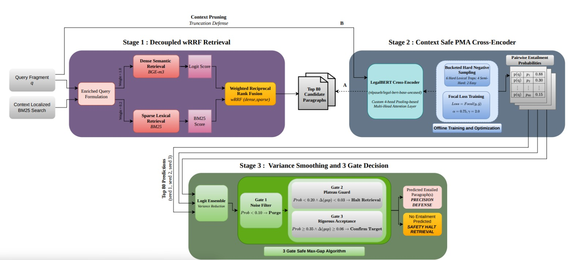

<div align="center">

# ⚖️ Decoupled Architecture for Legal Case Entailment

### Overcoming the Context Paradox and Lexical Traps in COLIEE 2026 Task 2

[](https://coliee.org/COLIEE2026/tasks/task2)
[](https://python.org)
[](https://pytorch.org)
[](LICENSE)
[](https://huggingface.co/nlpaueb/legal-bert-base-uncased)

**Team JUNLLP** · Jadavpur University & University of Glasgow

[Somdev Ganguli](mailto:somdevganguli@gmail.com) · Vibhan Dutta · Amit Barman · [Debasis Ganguly](mailto:debasis.ganguly@glasgow.ac.uk) · Sudip Kumar Naskar

---

*A 3-stage pipeline achieving **F1 = 0.3942** on the official COLIEE 2026 Task 2 leaderboard, establishing a high-precision operating point (Precision: 0.6721) that prioritizes reliable entailment identification over aggressive recall.*

</div>

---

## 📋 Table of Contents

- [Overview](#-overview)
- [Architecture](#-architecture)
- [Key Results](#-key-results)
- [Diagnostic Framework](#-diagnostic-framework)
- [Repository Structure](#-repository-structure)
- [Quick Start](#-quick-start)
- [Ablation Studies](#-ablation-studies)
- [Citation](#-citation)
- [License](#-license)

---

## 🔬 Overview

**Legal case entailment** requires identifying whether a specific historical paragraph logically supports a new legal decision fragment — a task plagued by two fundamental failure modes:

| Challenge | Description | Our Metric |
|-----------|-------------|------------|
| 🧩 **Context Paradox** | Prepending base-case context to queries forces truncation of ground-truth evidence within the 512-token transformer window | **TDI ≈ 10.07%** — 1 in 10 positive cases structurally lost |
| 🪤 **Lexical Trap** | Judicial boilerplate and standardized phrasing cause models to confuse surface-level overlap with genuine entailment | **74% false-positive rate** in high-LTD paragraphs |

We propose a **3-stage Decoupled Architecture** that explicitly defends against both failure modes through strict operational isolation: enriched queries for broad recall → aggressive context stripping for semantic precision → deterministic gating for variance reduction.

---

## 🏗️ Architecture

<div align="center">



*System architecture: Stage 1 (wRRF Retrieval) → Context Decoupling → Stage 2 (PMA Cross-Encoder) → Stage 3 (3-Gate Max-Gap)*

</div>

> **Key Design Philosophy**: Use contextually enriched queries to maximize initial recall, but *aggressively strip that context* before deep semantic classification to preserve structural integrity within the 512-token window.

---

## 📊 Key Results

### Official COLIEE 2026 Task 2 Leaderboard

| Model / Architecture | Precision | Recall | F1-Score |
|:---------------------|:---------:|:------:|:--------:|
| BM25 (Rank-1) | 0.5500 | 0.1871 | 0.2792 |
| BGE-m3 (Zero-Shot) | 0.5000 | 0.1701 | 0.2538 |
| NOWJ (2025 Reference) | 0.3788 | 0.2762 | 0.3195 |
| Vanilla BERT [CLS] | 0.6400 | 0.2177 | 0.3249 |
| LegalBERT [CLS] | 0.6800 | 0.2313 | 0.3452 |
| **JUNLLP (Ours: PMA + Ensemble)** | **0.6721** | **0.2789** | **0.3942** |

### Component-Wise Ablation (Test Set, 100 Queries)

| Configuration | Prec. | Recall | F1 |
|:--------------|:-----:|:------:|:--:|
| 1. Vanilla BERT [CLS] | 0.6400 | 0.2177 | 0.3249 |
| 2. LegalBERT [CLS] | 0.6800 | 0.2313 | 0.3452 |
| 3. LegalBERT + PMA | 0.6900 | 0.2347 | 0.3503 |
| 4. LegalBERT + PMA + Focal | 0.7100 | 0.2415 | 0.3604 |
| 5. + 3-Seed Ensemble (Top-1) | 0.7200 | 0.2449 | 0.3655 |
| **6. Full Pipeline (3-Gate)** | **0.7232** | **0.2755** | **0.3990** |

---

## 🔍 Diagnostic Framework

### Lexical Trap Divergence (LTD)

Quantifies when a model's confidence is driven by surface-level keyword overlap rather than genuine semantic entailment:

$$\mathrm{LTD}(q, p) = S_{lex}(q, p) \cdot \log \left( \frac{S_{lex}(q, p)}{S_{sem}(q, p) + \epsilon} \right)$$

- Paragraphs with **LTD > 1.5** correlate with a **74% false-positive rate** in standard BM25 retrieval
- Our cross-encoder successfully suppresses these traps (see [Table 1](paper/main.tex) in the paper)

### Truncation Damage Index (TDI)

Measures the fraction of ground-truth entailing paragraphs structurally beyond the transformer's context window:

$$TDI = \frac{|\{x_i : x_i > L_{\max}\}|}{N} \approx 0.1007$$

This motivated our "decoupling" strategy — stripping all base-case context before cross-encoding.

---

## 📁 Repository Structure

```
COLIEE-2026-Task2/
├── 📄 README.md                          # You are here
├── 📄 LICENSE                            # MIT License
├── 📄 requirements.txt                   # Python dependencies
├── 📄 .gitignore                         # Excludes large binaries & private docs
│
├── 📂 paper/                             # LaTeX source & figures
│   ├── main.tex                          # Camera-ready paper (ACM format)
│   ├── references.bib                    # Bibliography
│   └── 📂 figures/
│       ├── archite_diag.pdf              # System architecture diagram
│       ├── test_pr_curve.png             # Precision-Recall curve
│       └── attention_heatmap_cleaned.png # PMA attention rollout
│
├── 📂 notebooks/                         # Reproducible experiments
│   ├── coliee-task2.ipynb                # 🔥 Primary 3-stage pipeline
│   └── coliee-task2-slm-approach.ipynb   # SLM ablation (Qwen2.5-7B)
│
├── 📂 data/                              # Labels & checkpoints
│   ├── task2_train_labels_2026.json      # Training labels (925 queries)
│   ├── task2_test_labels_2026.json       # Test labels (100 queries)
│   └── bge_results_checkpoint.json       # Dense retrieval cache
│
└── 📂 results/
    └── COLIEE_2026_Task_2_CameraReady.pdf  # Final published paper
```

---

## 🚀 Quick Start

### Prerequisites

- Python 3.10+
- NVIDIA GPU with ≥16GB VRAM (Tesla T4 or better)
- CUDA 12.x

### Installation

```bash
git clone https://github.com/NoviceDev92/COLIEE-2026-Task-2.git
cd COLIEE-2026-Task-2
pip install -r requirements.txt
```

### Data Access

The COLIEE dataset requires [official registration](https://coliee.org/). After obtaining access:

1. Extract the case files into a `cases/` directory
2. Update the paths in `notebooks/coliee-task2.ipynb` to point to your local data

### Reproducing Results

The primary pipeline is contained in a single end-to-end notebook:

```bash
jupyter notebook notebooks/coliee-task2.ipynb
```

The notebook executes sequentially:
1. **Cell 1–2**: Data loading & preprocessing
2. **Cell 3**: Context compression & train/val split
3. **Cell 4**: Stage 1 — wRRF hybrid retrieval (BM25 + BGE-m3)
4. **Cell 5**: Bucketed negative sampling (6:4:2 Hard:Semi:Easy)
5. **Cell 6**: Stage 2 — LegalBERT + PMA cross-encoder training
6. **Cell 7–8**: 3-seed ensemble inference
7. **Cell 9**: Stage 3 — 3-Gate Max-Gap thresholding & evaluation

> **⏱️ Runtime**: ~2.5 hours end-to-end on a single Tesla T4 GPU

### Pre-trained Weights

The fine-tuned LegalBERT+PMA checkpoint (~443MB) is not included in this repository due to size constraints. To reproduce:
- Run the training cells in `coliee-task2.ipynb`, or
- Contact the authors for pre-trained weights

---

## 📈 Ablation Studies

Detailed ablation results are available in the paper (Section 5). Key findings:

| Experiment | Key Insight |
|------------|------------|
| **Component ablation** | Each stage contributes incrementally; 3-Gate provides the largest single-step recall boost (+0.0306) |
| **Negative sampling** | 6:4:2 ratio outperforms uniform (4:4:4), hard-heavy (8:2:2), and easy-heavy (2:4:6) configurations |
| **Threshold analysis** | 3-Gate Max-Gap achieves highest macro-F1 (0.5579) across all 15 strategies tested, indicating superior per-query consistency |
| **Context coupling** | Retaining base-case context in Stage 2 catastrophically degrades F1 from 0.3942 → 0.2335 |
| **Generative vs. discriminative** | Best SLM (CoT) achieves F1=0.3194 with precision 0.5752, well below our 0.6721 precision |

---

## 📝 Citation

If you use this code or find our work useful, please cite:

```bibtex
@inproceedings{ganguli2026decoupled,
  title={Strategic Formulation of the Decoupled Architecture for Legal Case 
         Entailment: Overcoming the Context Paradox and Lexical Traps},
  author={Ganguli, Somdev and Dutta, Vibhan and Barman, Amit and 
          Ganguly, Debasis and Naskar, Sudip Kumar},
  booktitle={Proceedings of the Competition on Legal Information 
             Extraction and Entailment (COLIEE 2026)},
  year={2026},
  address={Singapore}
}
```

---

## 🏛️ Acknowledgments

- **COLIEE Organizers** for providing the dataset and evaluation framework
- **Jadavpur University** and **University of Glasgow** for institutional support
- Compute resources provided by [Kaggle](https://www.kaggle.com/) (Tesla T4 GPU)

---

## 📄 License

This project is licensed under the MIT License — see the [LICENSE](LICENSE) file for details.

<div align="center">

---

*Built with ⚖️ for the legal NLP community*

**JUNLLP Team** · COLIEE 2026 · Singapore

</div>
